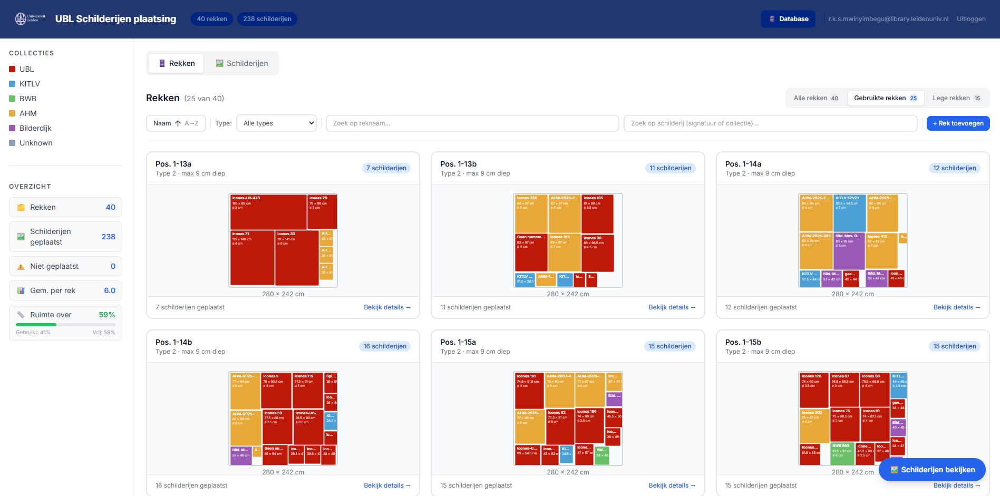

# UBL Painting Layout Visualizer

A **full-stack museum rack management system** built with React + TypeScript + Supabase that manages paintings across museum storage racks using a **Maximal Rectangles bin-packing algorithm**. Features secure authentication, real-time database sync, and an interactive visual dashboard.


---

## Features

### Core Functionality
- **Dashboard view** — all racks shown as responsive cards with miniature previews
- **Detail view** — full-scale rack rendering with signatuur labels and hover tooltips
- **Maximal Rectangles bin-packing** — fills every available gap in a rack (2 cm margin), not just horizontal rows
- **Database-backed** — all data persisted in Supabase with real-time sync
- **Secure authentication** — Clerk-based user authentication and authorization

### Painting Management
- **CSV bulk import** — seed database with paintings, racks, and rack types from CSV files
- **Predefined rack assignments** — paintings with a value in the `Rek` column are placed on that rack first (Phase 1), before any auto-assignment runs
- **Manual painting entry** — add individual paintings with dimensions and optional rack assignment
- **Search & filter** — find paintings by signatuur, dimensions, or assignment status
- **Unassign without reorganise** — removing a painting from a rack leaves all remaining paintings exactly where they are
- **Manual rack optimisation** — "🔄 Optimaliseer rek" button in the rack detail view re-runs bin-packing for just that rack
- **Delete with safety** — shows fill suggestions for freed space before deletion

### Rack Management
- **Rack types** — define reusable rack configurations (width, height, max depth)
- **Add/remove racks** — create racks from rack types or delete existing ones
- **Rack name search** — filter the dashboard by rack name in real time
- **Visual rack preview** — see exactly how paintings are arranged on each rack
- **Fill suggestions** — smart recommendations for paintings that fit freed space
- **Force placement** — manually assign paintings to specific racks

### Depth-Bracket Assignment
Paintings are restricted to the **lowest depth tier** that can accommodate them:

| Painting depth | Eligible racks (example tiers: 9 cm, 25 cm) |
|---|---|
| 0 – 9 cm | Only `maxDepth = 9` racks |
| 10 – 25 cm | Only `maxDepth = 25` racks |

This ensures deep racks are never filled with shallow paintings, leaving space for paintings that genuinely need the extra depth. Predefined rack assignments (`Rek` column) bypass this rule.

### Export & Re-import
- **Export CSV package** — downloads three CSV files (`schilderijen`, `rekken`, `rektypen`) reflecting the **current state** of all rack assignments. The paintings CSV has the `Rek` column pre-filled with each painting's current rack, making the export directly re-importable as a new starting set via the *Eigen CSV* seed tab.

### User Experience
- **Zoom slider** — adjust render scale (1–4 px/cm) in detail view
- **Responsive tabs** — switch between racks view and paintings list
- **Loading indicators** — spinners and progress feedback for all async operations
- **Error recovery** — timeout handling (30 s) with retry capability
- **Database panel** — manage database, seed data, export state, and maintain rack types

---

## Tech Stack

| Layer | Technology |
|---|---|
| Frontend | React 18 + TypeScript (strict mode) |
| Styling | Tailwind CSS v3 |
| State management | SWR for server state, React hooks for local state |
| Backend | Supabase (PostgreSQL) |
| Authentication | Clerk (optional) |
| API | Express (TypeScript) |
| Hosting | Railway |
| Bundler | Vite 6 |
| CSV parsing | PapaParse |
| Development | Docker / Podman with hot reload |

---

## Project Structure

```
src/
├── types.ts                         # Core types: Painting, Rack, RackType, etc.
├── constants.ts                     # MARGIN (2 cm), SCALE
├── App.tsx                          # Root: state, routing, dialog management
├── main.tsx                         # Entry point with auth providers
├── components/
│   ├── Header.tsx                   # App header with database button
│   ├── Sidebar.tsx                  # Summary stats + zoom control
│   ├── Dashboard.tsx                # Rack cards grid with name/painting/type filters
│   ├── RackCard.tsx                 # Single rack card with preview
│   ├── RackDetail.tsx               # Full rack view + optimise button + painting list
│   ├── RackCanvas.tsx               # Rack rendering canvas
│   ├── PaintingRect.tsx             # Painting rectangle + tooltip
│   ├── PaintingsList.tsx            # Searchable paintings table
│   ├── DatabasePanel.tsx            # Seed, export, rack types, clear data
│   ├── AddPaintingModal.tsx         # Add new painting form
│   ├── AddRackModal.tsx             # Add new rack form
│   ├── AddRackTypeModal.tsx         # Add new rack type form
│   ├── UnassignPaintingDialog.tsx   # Unassign confirmation (positions preserved)
│   ├── RemovePaintingDialog.tsx     # Delete confirmation with fill suggestions
│   ├── AuthGuard.tsx                # Authentication wrapper
│   ├── Tooltip.tsx / Legend.tsx / SummaryPanel.tsx / ZoomSlider.tsx
│   └── ...
├── hooks/
│   ├── useAssignment.ts             # SWR hook for rack assignment
│   ├── usePaintings.ts              # SWR hook for paintings
│   ├── useAuthFetch.ts              # Authenticated fetch wrapper
│   └── ...
├── utils/
│   ├── assignPaintingsToRacks.ts    # Maximal Rectangles algorithm (frontend)
│   ├── getPlacementFailReason.ts    # Why a painting couldn't be placed
│   ├── parsePaintingsCsv.ts         # Parses paintings CSV incl. Rek column
│   ├── parseRacksCsv.ts
│   └── parseRackTypesCsv.ts
└── lib/
    ├── clerk.ts                     # Clerk configuration
    └── supabase.ts                  # Supabase client

api/                                 # API handlers (Express, Railway)
├── health.ts                        # GET  /api/health
├── paintings.ts                     # GET/POST /api/paintings
├── paintings/[id].ts                # GET/PUT/DELETE /api/paintings/:id
├── racks.ts                         # GET/POST/DELETE /api/racks
├── rack-types.ts                    # GET/POST/DELETE /api/rack-types
├── assignment.ts                    # GET/POST /api/assignment
├── suggest-rack.ts                  # GET /api/suggest-rack
├── fill-suggestions.ts              # GET /api/fill-suggestions
├── reorganise-rack.ts               # POST /api/reorganise-rack
├── export.ts                        # GET  /api/export
├── clear-all.ts                     # POST /api/clear-all
├── seed.ts                          # POST /api/seed
└── _lib/
    ├── placement.ts                 # Maximal Rectangles algorithm (API copy)
    ├── store.ts                     # Supabase data access layer
    └── auth.ts                      # Token verification

supabase/migrations/
├── 001_initial_schema.sql
└── 002_indexes.sql
```

---

## Bin-Packing Algorithm

The application uses a **Maximal Rectangles (MAXRECTS)** algorithm with **Best Short Side Fit (BSSF)** to pack paintings into every available space on a rack — not just left-to-right rows.

### How It Works

1. **Free rectangles** — the rack starts as a single free rectangle. After each placement, the used area is subtracted and the overlapping free rects are split into up to 4 axis-aligned pieces.
2. **Dominated rect pruning** — any free rect fully contained within another is removed, keeping the list minimal and correct.
3. **Best Short Side Fit** — for each painting, the free rect that minimises the shorter leftover dimension is chosen (tightest fit).
4. **Area-descending sort** — in bulk assignment, largest paintings are placed first, leaving smaller gaps for smaller paintings.
5. **Two-phase assignment**:
   - **Phase 1 – Predefined racks**: paintings with a value in the `Rek` CSV column are placed on that exact rack first, regardless of depth tier or priority.
   - **Phase 2 – Depth-bracket auto-assignment**: remaining paintings are sorted by area (largest first). Each painting is restricted to the lowest depth tier (derived from all available rack `maxDepth` values) that still accommodates its depth — preventing shallow paintings from consuming space on deep racks. Within the eligible tier, priority racks are tried first.

### Placement Constraints

- **Width**: `painting.width + 2 × MARGIN ≤ rack.width`
- **Height**: `painting.height + 2 × MARGIN ≤ rack.height`
- **Depth (exact tier)**: painting is placed only on racks in the minimum fitting depth tier — e.g., a 3 cm deep painting goes to `maxDepth=9` racks only, never to `maxDepth=25` racks
- **MARGIN**: 2 cm on all sides (between paintings and between paintings and walls)
- **Predefined override**: a `Rek` value in the CSV bypasses the depth-bracket rule

> The algorithm lives in `src/utils/assignPaintingsToRacks.ts` and is mirrored verbatim in `api/_lib/placement.ts`. Keep both files in sync when making changes.

### Manual Optimisation

Removing a painting from a rack **does not** automatically reorganise the remaining paintings — their positions are preserved. To compact the rack and re-run bin-packing, use the **🔄 Optimaliseer rek** button in the rack detail view (`POST /api/reorganise-rack`).

---

## Dialog System

### Unassign Painting Dialog (`UnassignPaintingDialog.tsx`)
- ✅ Confirmation with painting & rack details
- ✅ Loading spinner while API call runs
- ✅ 30-second timeout — painting stays assigned on timeout
- ✅ Error message + retry button
- ✅ Auto-closes on success
- ✅ Remaining paintings keep their exact positions (no reorganisation)

### Delete Painting Dialog (`RemovePaintingDialog.tsx`)
- ✅ All of the above
- ✅ Shows fill suggestions (paintings from the unassigned list that fit the freed space)
- ✅ One-click assign from suggestions

---

## Supabase Setup

These steps apply to both local development and all production deployments.

### 1. Create a Supabase project

1. Go to [supabase.com](https://supabase.com) → **New project**
2. Choose a name, database password, and region
3. Wait for provisioning to finish (~1–2 minutes)

### 2. Collect your API keys

Open your project → **Settings → API**:

| Key | Where to find it | Used by |
|---|---|---|
| **Project URL** | "Project URL" field | Frontend + backend |
| **anon / public** key | "Project API keys" → `anon public` | Frontend (`VITE_SUPABASE_ANON_KEY`) |
| **service_role** key | "Project API keys" → `service_role` ⚠️ secret | Backend only (`SUPABASE_SERVICE_KEY`) |

> ⚠️ Never expose the `service_role` key to the browser — it bypasses all RLS policies.

### 3. Run migrations

Open **SQL Editor** in the Supabase dashboard and run the files below in order, or use the CLI (`supabase db push` if the project is linked):

| File | What it does |
|---|---|
| `supabase/migrations/001_initial_schema.sql` | Creates all tables |
| `supabase/migrations/002_indexes.sql` | Adds performance indexes |
| `supabase/migrations/002_enable_rls.sql` | *(Recommended)* Enables Row-Level Security |

> **RLS note**: `002_enable_rls.sql` restricts direct PostgREST access to authenticated users. The backend always uses the `service_role` key which bypasses RLS, so enabling it has no effect on API behaviour but prevents accidental data exposure.

### 4. Free-tier gotcha

Supabase pauses free projects after 1 week of inactivity. If `/api/health` times out, resume the project from your Supabase dashboard.

---

## Local Development

### Prerequisites
- Node.js 20+, npm 9+
- Supabase project (see [Supabase Setup](#supabase-setup) above)
- Clerk account (optional)

### 1. Environment variables

Copy `.env.example` to `.env.local` and fill in your values:

```env
# Frontend (Vite build-time — must be VITE_ prefixed)
VITE_SUPABASE_URL=https://your-project.supabase.co
VITE_SUPABASE_ANON_KEY=your-anon-public-key

# Backend API (runtime — never exposed to the browser)
SUPABASE_URL=https://your-project.supabase.co
SUPABASE_SERVICE_KEY=your-service-role-key

# Clerk (optional)
VITE_CLERK_PUBLISHABLE_KEY=pk_test_...
CLERK_SECRET_KEY=sk_test_...
```

### 2. Run

```bash
npm install
npm run dev     # http://localhost:5173
```

### 3. Seed demo data

Click **Database** in the app header → **Start data** → **Start data laden**.

---

## Docker / Podman

```bash
# Development (hot reload)
podman compose up painting-layout-dev

# Rebuild after dependency changes
podman compose down -v
podman compose build --no-cache painting-layout-dev
podman compose up painting-layout-dev

# Production
podman compose --profile prod up painting-layout-prod   # http://localhost:3000
```

The `node_modules` named volume persists dependencies between restarts.

---

## Deploy to Railway

Railway runs the self-hosted **Express server** (`server/index.ts`) inside the production Docker image. The static frontend and all API routes are served from a single container on port `3000`.

### How it works

```
Docker (production stage)
  └─ npm run build:all        # builds dist/ (frontend) + dist-server/ (Express)
  └─ node dist-server/server/index.js   # serves both on PORT
```

### Steps

#### 1. Create a Railway project

1. Go to [railway.app](https://railway.app) → **New Project** → **Deploy from GitHub repo**
2. Select your repository
3. Railway auto-detects the `Dockerfile` and uses the `production` stage

#### 2. Set environment variables

In Railway → your service → **Variables**, add **all** of the following:

| Variable | Value | Notes |
|---|---|---|
| `VITE_SUPABASE_URL` | `https://your-project.supabase.co` | **Build-time** — baked into the frontend bundle |
| `VITE_SUPABASE_ANON_KEY` | your anon/public key | **Build-time** — baked into the frontend bundle |
| `SUPABASE_URL` | `https://your-project.supabase.co` | Runtime — used by Express API handlers |
| `SUPABASE_SERVICE_KEY` | your service_role key | Runtime — keep secret, never expose publicly |
| `CLERK_SECRET_KEY` | `sk_test_...` | Optional — only if using Clerk auth |

> The `VITE_*` variables are passed as Docker build args, so they must be set **before** the first deploy (or trigger a redeploy after adding them). `PORT` is set automatically by Railway — do not override it.

#### 3. Configure the build

Railway should automatically pick up the `Dockerfile`. If it doesn't:
- Go to **Settings → Build** → set **Builder** to `Dockerfile`
- Set **Dockerfile path** to `Dockerfile`

#### 4. Deploy

Click **Deploy** (or push to your connected branch). Railway will:
1. Pass `VITE_SUPABASE_URL` and `VITE_SUPABASE_ANON_KEY` as Docker build args
2. Build the frontend bundle and Express server with `npm run build:all`
3. Start `node dist-server/server/index.js` on the assigned `PORT`

Once deployed, Railway provides a public URL (e.g. `https://your-app.up.railway.app`).

#### 5. Seed demo data

Open the app URL → **Database** → **Start data** → **Start data laden**.

---

## API Endpoints

| Method | Path | Auth | Description |
|---|---|---|---|
| GET | `/api/health` | — | Database health check |
| GET | `/api/paintings` | — | List paintings (paginated) |
| POST | `/api/paintings` | ✅ | Create painting |
| GET | `/api/paintings/:id` | — | Get single painting |
| PUT | `/api/paintings/:id` | ✅ | Update / reassign painting (positions preserved) |
| DELETE | `/api/paintings/:id` | ✅ | Delete painting (cascade removes from placement) |
| GET | `/api/racks` | — | List racks |
| POST | `/api/racks` | ✅ | Create rack |
| DELETE | `/api/racks` | ✅ | Delete rack |
| GET | `/api/rack-types` | — | List rack types |
| POST | `/api/rack-types` | ✅ | Create / update rack type |
| DELETE | `/api/rack-types` | ✅ | Delete rack type |
| GET | `/api/assignment` | — | Current placement result |
| POST | `/api/assignment` | ✅ | Save assignment |
| GET | `/api/suggest-rack` | — | Rack suggestions for a painting |
| GET | `/api/fill-suggestions` | — | Paintings that fit freed space |
| POST | `/api/reorganise-rack` | ✅ | Re-run bin-packing for one rack |
| GET | `/api/export` | ✅ | Export current state as 3 CSV strings |
| POST | `/api/seed` | ✅ | Bulk import from CSV (multipart or default demo) |
| POST | `/api/clear-all` | ✅ | Wipe all data |

---

## CSV Format

All files use **semicolon (`;`)** as delimiter and **Dutch decimal notation** (comma as decimal separator, e.g. `86,5`).

### Paintings (`Collectie;signatuur;Hoogte (cm);Breedte (cm);Diepte (cm);Rek`)

```csv
Collectie;signatuur;Hoogte (cm);Breedte (cm);Diepte (cm);Rek
UBL;Icones 67;86,5;75,5;3;
UBL;COLLBN 053-51;60;45;4;Pos. 5-1a
AHM-1990-236;AHM-1990-236;80;60;2;Pos. 3-22a
```

- `Rek` (optional) — forces the painting onto that rack in Phase 1, bypassing auto-assignment
- Depth defaults to `0` if the column is empty

### Rack Types (`Type schilderijenrekken;Hoogte (cm);Breedte (cm);Maximale diepte (cm)`)

```csv
Type schilderijenrekken;Hoogte (cm);Breedte (cm);Maximale diepte (cm)
1;242;395;9
5;240;375;25
```

### Racks (`Nummer;Type`)

```csv
Nummer;Type
Pos. 5-1a;5
Pos. 1-2a;1
```

Demo files: `public/demo-paintings.csv`, `public/demo-rack-types.csv`, `public/demo-racks.csv`.

### Export & Re-import Workflow

1. Open **Database** panel → **📥 Exporteer** tab → **Download CSV-pakket**
2. Three files are downloaded: `schilderijen-export-YYYY-MM-DD.csv`, `rekken-export-…`, `rektypen-export-…`
3. The paintings file has the `Rek` column pre-filled with each painting's **current rack**
4. To restore: open **Eigen CSV** tab → upload the three exported files → **Bestanden laden**
5. Rack assignments are preserved via Phase 1; positions are recalculated by bin-packing

---

## Troubleshooting

| Symptom | Fix |
|---|---|
| `/api/*` returns JS source instead of JSON | Add missing route to `apiRouterPlugin()` in `vite.config.ts` |
| Painting returns 404 on PUT/DELETE | Fixed — `getPaintingById(id)` is used (no 100-row limit). Ensure DB is seeded. |
| Docker: module not found | `podman compose down -v && podman compose build --no-cache` |
| Supabase timeout on `/api/health` | Project may be paused (free tier). Resume it in the Supabase dashboard |
| `SUPABASE_SERVICE_KEY` errors | Use the **service_role** key, not the anon key |
| Deep paintings can't be placed | Ensure painting `depth > 0` and a rack with sufficient `maxDepth` exists. Shallow paintings (depth ≤ 9 cm) are blocked from deep racks by the depth-bracket rule. |
| Export downloads empty files | Requires authentication — ensure you are logged in before exporting |

---

## Contributing

1. Fork → feature branch → PR
2. Keep `src/utils/assignPaintingsToRacks.ts` and `api/_lib/placement.ts` in sync — they contain the same algorithm.
3. When adding a new API route, register it in `apiRouterPlugin()` in `vite.config.ts` for local dev.

---

## License

Available for educational and museum use. Credit the original authors when reusing.
